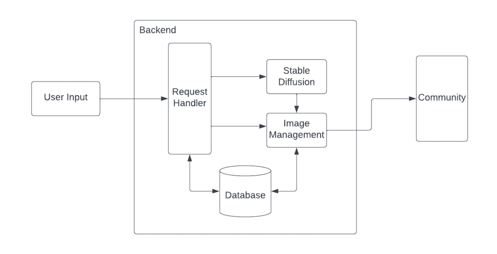

# Introduction
## ImageDiffusion by Aum Wadhwani, Pratik Alladi, Zidi Xiong, and Rainbow Li

## What is ImageDiffusion?
This webpage allows users to edit photos and add decorations to images easily. No prior experience like coding or photoshop knowledge is required. As everything is hosted on a website, users can also save time and effort from having to download and install large pieces of software or requiring computers with powerful components. The modified images will be saved in their library on the website. There is a detailed history of images under their profile which they can reference as well. 

Our functionality includes:
- Users can access the website and upload their own images and prompt the diffusion AI model to edit it
- The website can store the prompts and images for the user
- The stored images can be rendered next time.
- the generated contents of user is posted on that website.


# Technical Architecture


# Environment Installation
```shell
pip install -r requirements.txt
```


# Usage Instructions
```shell
cd project
python manage.py runserver
```

